# Predicting Pneumonia Using Neural Networks

With a hospitalization rate of 700,000 people, annually, pneumonia is one of the leading causes of inpatient stays nationwide. 
During current times and with the constant increasing cost of healthcare, it is important to be efficient and deliberate when diagnosing and treating ill patients. Hospital stays are reserved for extremely sick patients and since the start of the COVID-19 pandemic, hospitals are overwhelmed. In relation to this project, our goal is to be able to predict pneumonia quickly and efficiently to help reduce the cost, hospitalizations, and increase efficiency in terms of diagnosing and treating the patient. With that being said, how accurately can we predict pneumonia using a neural network (NN)?

### Background

Pneumonia, in layman's terms, is an infection of one or both of lungs. It is caused by microbes such as viruses, bacteria, fungi, or can also be caused by environmental causes. Symptoms of pneumonia depend on each individual but those who are over the age of 65, immunocompromised, smokers, children/toddlers are at greater risks of fatal symptoms such as sepsis and respiratory distress.

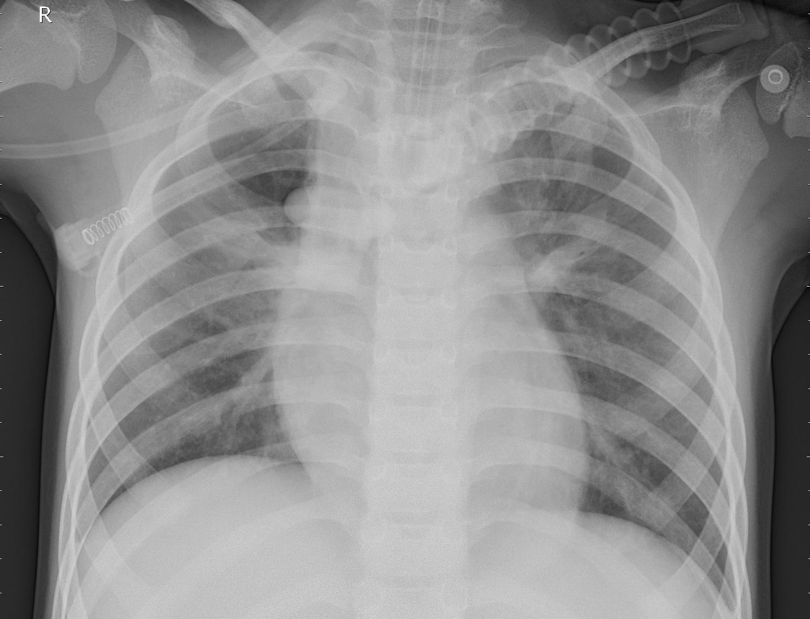\
Lungs with pneumonia.

Normal and healthy lungs.

### The Data

We obtained data from Kaggle containing ~5,800 chest X-Rays (CXR) divded up between train, test, and validation imagesets. For the sake of this project, we opted to not use the validation set. 

### The Models
- **Multilayer Perceptron (MLP)**:\
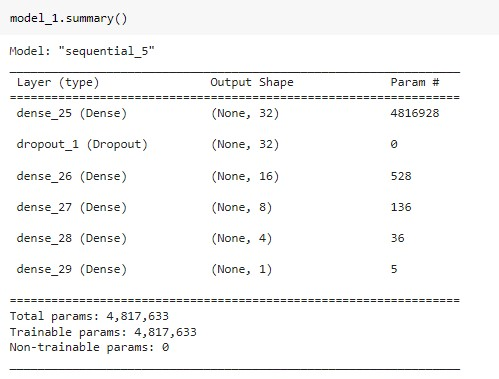
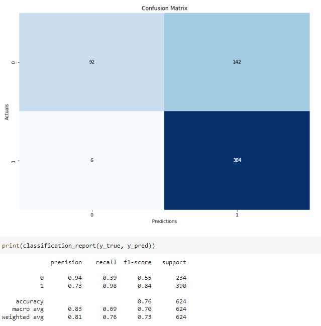\
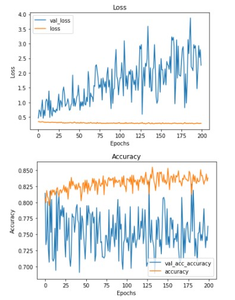\
\
Our MLP gave us a 76% accuracy rate. 

- **Convolutional Neural Network (CNN)**:\
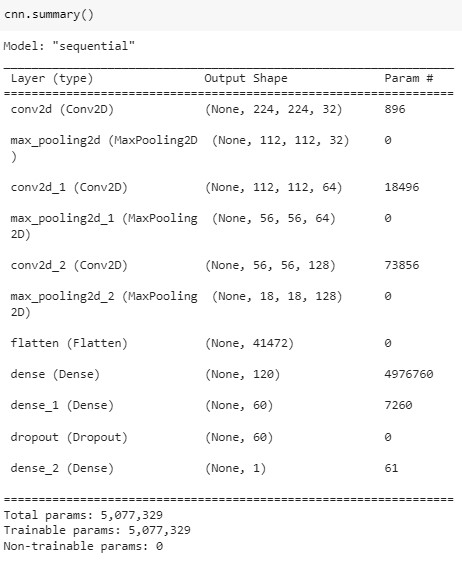\
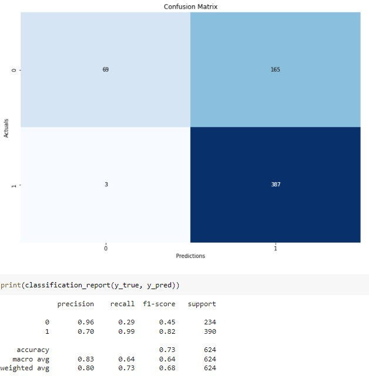\
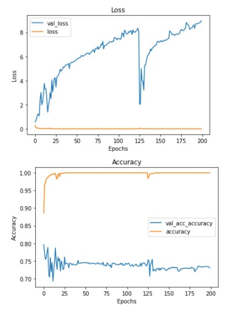\
\
Our baseline CNN gave us 73% accuracy rate.
- **Tuned CNN**:\
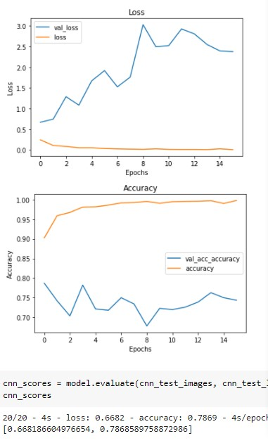\
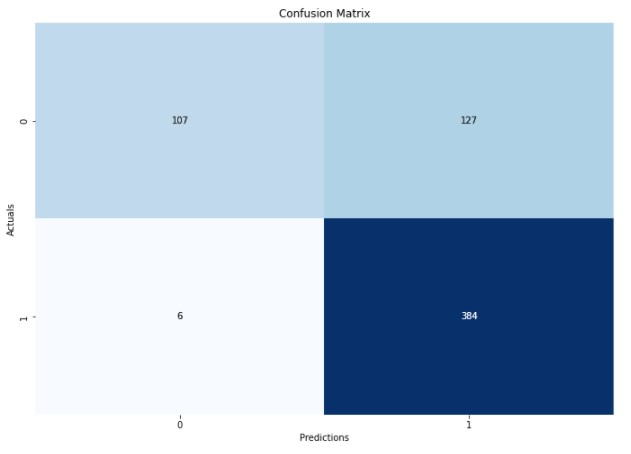\
\
Tuning and adjusting the optimizer, activation, dropout rate, and establishing an Early Stop, we were able to get 79% accuracy rate.

- **Transfer Learning CNN**:\
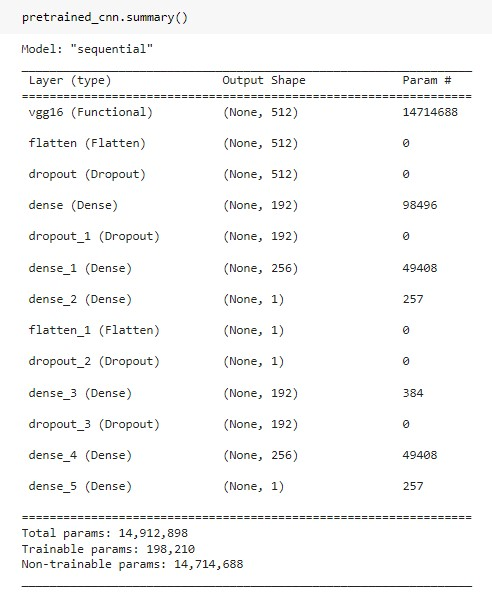\
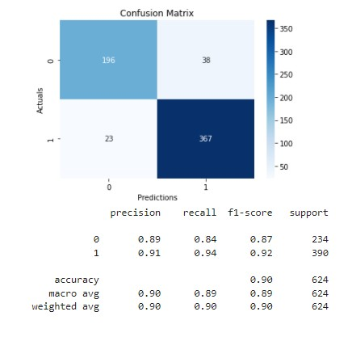\

Using VGG16 to help us train our model allowed us to achieve a 90% accuracy rate. 

## Results and Future Improvements 

The MLP, both CNNs and the transfer learning CNN did pretty well. The MLP and basic CNN models showed overfitting. We can try and adjust for that in the future by tuning the hyperparameters to fit the specific model accordingly. For example, we can adjust the dropout and learning rates and then add in more EPOCHs and try other optimizers or activations. 
For our Transfer Learning CNN, we can try other combinations of activation and optimizers. Previously we tried 'adam' and 'relu' and our accuracy was at 85%. That is still sufficient but we kept our current model because it gave us an accuracy rate of 90%. We can also try other pretrained models such as VGG19.

## Future Works

Neural Networks are powerful, powerful tools. The image classification use of neural network can be used in the future to help modernize and improve efficiency in other areas of medicine as well. The goal is to help improve and increase efficiency to help reduce the cost of healthcare and I believe this is one of the ways to do so. By allowing computers to help us (with proper supervision), we can get better, more precise results to help improve the lives of patients. In relation of this specific project, we can use this method to help with other areas of medicine such as oncology, cardiology, and orthopedics. We can use this method to help get results back faster to patients and help speed up their care plans. This is a pathway to the future of medicine. 
